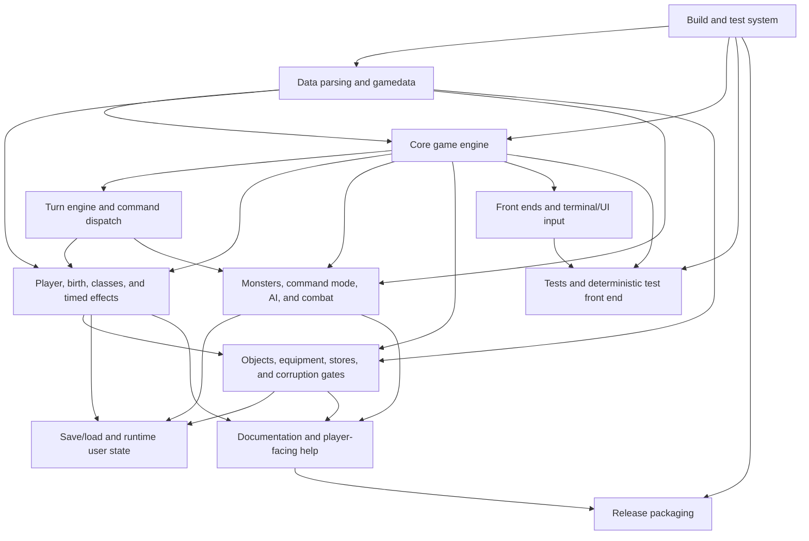

# Heroband Spec Extraction Plan

> **Created**: 2026-05-25
> **Mode**: Brownfield - extracting specs from existing codebase
> **Approach**: Descriptive requirements extraction that becomes prescriptive specs

---

## Project Context

Heroband is a morally heroic fork of Angband 4.2. It preserves classic Angband
roguelike gameplay where practical while enforcing the central rule that the
player may fight evil but may not wield evil. The target users are players and
maintainers who want Angband-style dungeon exploration, combat, character
progression, and terminal/front-end play without player-accessible demonic,
necromantic, blood, occult, corrupt shadow, or similarly evil power sources.

## Systems to Specify

| System | Spec File | Primary Code Locations | Discovery Strategy |
|--------|-----------|------------------------|-------------------|
| Project rule and ubiquitous language | `UBIQUITOUS_LANGUAGE.md` | `AGENTS.md`, `README.md`, docs, gamedata names | Extract canonical terms, aliases, overloaded terms, and moral-access categories. |
| Build and test system | `build-test.md` | `CMakeLists.txt`, `src/cmake`, `tests`, `src/tests`, make/autotools files | Map supported build modes, test targets, front-end options, and validation gates. |
| Data parsing and gamedata | `data-parsing.md` | `lib/gamedata`, parser code, `src/tests/parse` | Trace data files to parser-owned runtime structures and parser tests. |
| Core game engine | `core-engine.md` | `src/main.c`, `src/game-world.c`, cave/generation/effects/event systems | Extract game loop responsibilities, world state transitions, event/message contracts, and generation boundaries. |
| Turn engine and command dispatch | `turn-engine.md` | `src/cmd-core.c`, `src/game-world.c`, command handlers, timed effects tests | Prioritize this first. Extract command queue semantics, forced turns, energy accounting, command-mode dispatch, and no-energy loop prevention. |
| Player, birth, classes, and timed effects | `player.md` | player files, birth UI, class data, timed effect definitions/tests | Extract player lifecycle, class/race selection, timed effects, and player-access restrictions. |
| Monsters, command mode, AI, and combat | `monsters-combat.md` | monster files, command mode code, combat handlers, monster gamedata | Extract monster lifecycle, AI action selection, command control, lore, attacks, and enemy-only evil content boundaries. |
| Objects, equipment, stores, and corruption gates | `objects-corruption.md` | object/store/effect files, corruption tests, object/store gamedata | Extract object use, equipment, store access, corruption warnings/consequences, and player-benefit restrictions. |
| Save/load and runtime user state | `save-load.md` | save/load files, runtime user directories, panic save handling | Extract save compatibility, runtime paths, panic saves, and recovery behavior. |
| Front ends and terminal/UI input | `frontends-ui.md` | `src/main-gcu.c`, UI files, front-end mains, help/customize files | Extract input event contracts, terminal prompts, menu behavior, and front-end ownership boundaries. |
| Tests and deterministic test front end | `test-system.md` | `src/tests`, `tests`, `src/main-test.c`, CMake test targets | Extract unit/scripted test patterns, scenario setup, and coverage expectations. |
| Documentation and player-facing help | `docs-help.md` | `docs`, `lib/help`, `lib/customize`, hints | Extract documentation consistency rules and player-facing terminology. |
| Release packaging | `release-packaging.md` | release docs, packaging scripts, generated archive rules | Extract release asset, checksum, source archive, and validation requirements. |

## Extraction Approach

For each system, the extracting agent MUST:

1. **Read the code and existing docs** to understand current behavior.
2. **Write prescriptive specs** that define what the system MUST do, phrased as
   requirements and rules rather than implementation commentary.
3. **Include no code in authored specs**. Do not include file paths, code
   snippets, or implementation references in final spec files. This plan may
   contain paths because it is an extraction guide.
4. **Extract parameters**. Any tuning values, limits, timers, thresholds,
   chances, costs, and compatibility constants belong in `parameters.md` with a
   rationale.
5. **Identify error cases** by reading failure paths, prompts, save/recovery
   logic, parser errors, command cancellation, invalid state handling, and tests.
6. **Derive test scenarios** from existing tests, bug regressions, player-visible
   flows, documented behavior, and discovered edge cases.
7. **Preserve Heroband's moral rule** by distinguishing player-accessible power,
   enemy-only evil, ambient lore, harmless names, and ambiguous cases.

## Initial Suspected Term Collisions

These terms should be captured in `UBIQUITOUS_LANGUAGE.md` and refined during
extraction:

| Term | Suspected Collision |
|------|---------------------|
| command | User input command, queued engine command, commanded-monster action. |
| command mode | Player state for controlling a monster, versus general UI command handling. |
| turn | Player action, forced sleep/upkeep turn, monster turn, game loop iteration. |
| energy_use | Command cost, turn progression gate, no-energy loop signal. |
| evil | Enemy-only content versus forbidden player-accessible power. |
| corruption | Player moral state, item warning/consequence system, ambient enemy theme. |
| class slot | Player-facing class versus legacy internal compatibility ID. |

## Dependency Graph

## Authoring Order

Follow this order so foundational vocabulary and build constraints are known
before behavior specs depend on them. The turn-engine spec is the first
behavior extraction priority because it has an active regression and a known
architectural invariant to preserve.

1. `UBIQUITOUS_LANGUAGE.md` - project rule, moral-access terms, overloaded terms.
2. `parameters.md` - global timers, energy costs, parser limits, tuning values.
3. `build-test.md` - build modes, test targets, front-end options.
4. `data-parsing.md` - gamedata loading and parser contracts.
5. `core-engine.md` - game loop, world state, event/message responsibilities.
6. `turn-engine.md` - command queues, forced turns, energy, command mode.
7. `player.md` - player lifecycle, birth, classes, timed effects.
8. `monsters-combat.md` - monster lifecycle, AI, command control, combat.
9. `objects-corruption.md` - items, equipment, stores, corruption gates.
10. `save-load.md` - save compatibility, runtime state, panic recovery.
11. `frontends-ui.md` - terminal/UI input, prompts, menus, front-end boundaries.
12. `test-system.md` - deterministic tests, scripted frontend, scenario evidence.
13. `docs-help.md` - docs/help consistency and player-facing terms.
14. `release-packaging.md` - release assets, checksums, archive rules.

## Turn Engine Priority Extraction

Create `turn-engine.md` first after the foundation files. The initial invariant
to extract and formalize:

- Internally queued forced-turn or upkeep commands MUST remain distinct from
  player-entered command intent.
- Paralysis and knockout forced turns MUST consume energy and MUST NOT enter a
  no-energy loop.
- Command-mode remapping MUST apply to player command intent, not to forced
  upkeep commands such as sleep.
- A repeated unchanged `-more-` prompt with unchanged energy is a turn-engine
  bug signal, not merely a terminal input issue.

Initial test scenarios to derive:

- A commanded player who becomes paralyzed still spends a forced turn.
- A forced sleep/upkeep command consumes movement energy while command mode is
  active.
- Invalid commanded-monster actions do not consume energy and do not mask forced
  turn commands.
- Terminal `-more-` recovery distinguishes ordinary acknowledgement prompts
  from no-energy command loops.

## Code Mapping

### Turn Engine and Command Dispatch

**Known paths**: `src/cmd-core.c`, `src/game-world.c`, `src/cmd-cave.c`,
`src/player-timed.c`, `src/mon-timed.c`, `src/tests/game/basic.c`.

**Discovery strategy**: Search for command queue operations, `energy_use`,
timed-effect forcing logic, `TMD_COMMAND`, `TMD_PARALYZED`, knockout/stun
grades, and forced sleep/upkeep commands.

**Extraction focus**:
- How commands enter and leave the command queue.
- How player-entered commands differ from internally queued commands.
- How command mode remaps player command intent.
- How energy consumption gates game-loop progress.
- How invalid commands, cancellation, prompts, and no-energy states behave.
- How paralysis, knockout, and command mode interact.

### Front Ends and Terminal/UI Input

**Known paths**: `src/main-gcu.c`, `src/ui-input.c`, `src/ui-term.c`,
`src/ui-game.c`, front-end mains.

**Discovery strategy**: Search for key event conversion, `-more-`, `anykey`,
terminal resize/input handling, and command processing.

**Extraction focus**:
- Keyboard event normalization.
- Prompt acknowledgement behavior.
- Terminal-session recovery and panic-save reporting.
- Boundaries between UI input and gameplay rules.

### Save/load and Runtime User State

**Known paths**: `src/savefile.c`, `src/load.c`, `src/save.c`,
`src/ui-signals.c`, runtime `lib/save` and `lib/panic` directories.

**Discovery strategy**: Search savefile load/save entry points, panic-save path
construction, signal handling, runtime directory initialization, and save tests.

**Extraction focus**:
- Save compatibility and load lifecycle.
- Panic-save trigger, success/failure reporting, and file location.
- Runtime state ownership and generated-file boundaries.

### Remaining Systems

For the remaining systems, start from the path map in `AGENTS.md`, then use
focused searches for system nouns, parser names, command names, tests, and docs.
Keep final specs behavior-focused and free of file paths.

## Quality Gates

After each spec is authored:

- [ ] All required sections are present: overview, dependencies, parameters,
      data structures, behavior, error handling, implementation notes, test
      scenarios, changelog.
- [ ] No code or file path references appear in the spec.
- [ ] Every parameter has a rationale.
- [ ] Every behavior has at least one test scenario.
- [ ] All cross-references link to existing specs.
- [ ] The ubiquitous language is consistent with terms used in the spec.
- [ ] Heroband moral-access rules distinguish player-accessible power from
      enemy-only evil.
- [ ] Version is bumped to 1.0.0 when the spec is fully authored and reviewed.

